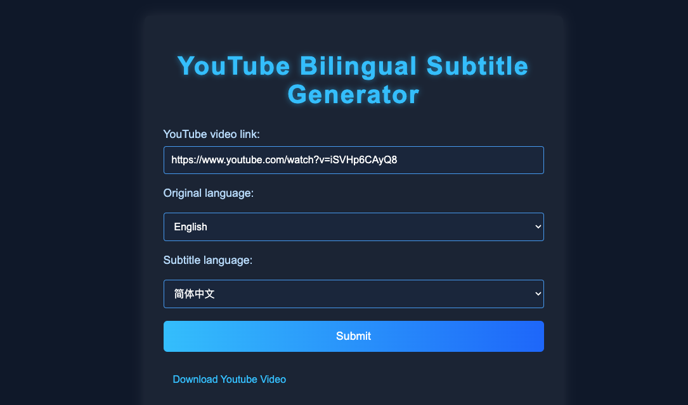
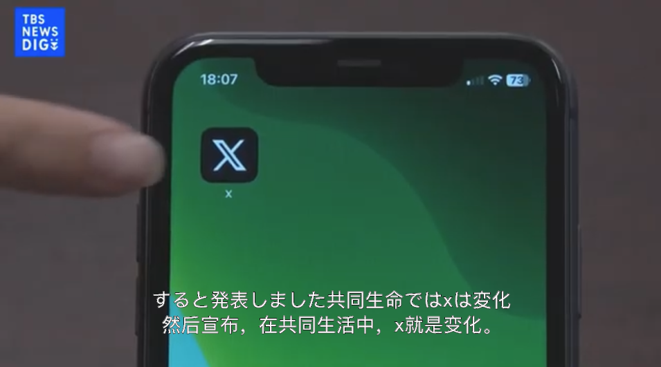

# YouTube Downloader and Bilingual Subtitle Generator


This tool allows you to freely download YouTube videos and generate bilingual subtitles.

## Quick Start

```bash
npm run install
node index.mjs
```

<div align="center">

</div>


# How it Works
This application helps you to:
* **Download YouTube videos:** Easily download videos in various formats.
* **Generate Bilingual Subtitles:** Create subtitles with both original audio text and translations. You can select your original language and the target language of the subtitle.

# Result Screenshots

<div align="center">


</div>

**Key Features:**
*   **Free to Use:** Download videos and generate subtitles without any cost.
*   **Bilingual Support:** Create subtitles that show the original language and a translated version.
*   **Multiple Language Support:** Supports a variety of languages for both original and translated subtitles.

**How to Use:**

1.  **Input YouTube Link:** Paste the URL of the YouTube video you want to download or create subtitles for.
2.  **Choose Languages:** Select the original language of the video and the desired language for the translation.
3.  **Submit:** Click the submit button to download the video or generate the bilingual subtitle.
4.   **Download:** The downloaded video or the generated subtitle file will be downloaded.

**Note:**

*   This application uses third-party services for video download and translations, please be aware of any limitations.
*   Always use this application in accordance with YouTube's Terms of Service.

This README provides a clear, concise overview of your project, its features, and how to use it. If you have any other details to add, let me know!
